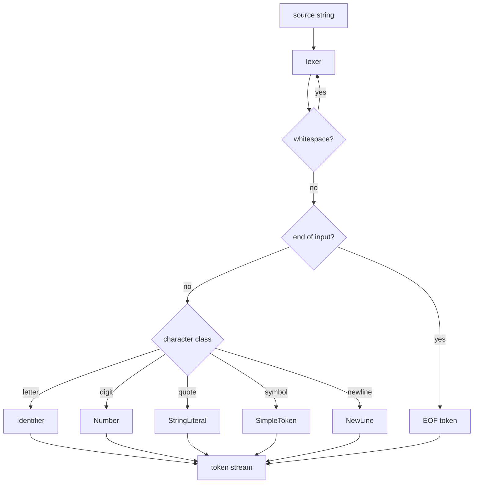

# gauge

A small programming language inspired by **Jai** and **Odin**, written in Odin itself.

[](https://github.com/londospark/gauge/actions/workflows/ci.yml)

> **Status:** the front end is green, and consts compile to C and run — the demo goes from gauge source to a running binary. Blocks and procedures next (see [TODO.md](TODO.md)).

## Design

A consistent syntax that just does what people want it to do — see [docs/design.md](docs/design.md) for the principles, the lineage (Pascal/Wirth vs C), and the resources behind the language.

## What's here

- A **cursor-based lexer** that turns source text into a token stream.
- Tokens carry **byte offsets**, not line/column numbers — positions stay O(1) to jump to, and the editor/compiler pipeline never has to count newlines.
- **Newlines are explicit tokens**, so the parser decides whether one ends a statement.
- Token values are **zero-copy slices** of the source; strings are escape-aware (`\"`, `\\`).
- **Table-driven test suites** (`compiler/lexer_test.odin`, `compiler/parser_test.odin`, ...) run with one command — `devenv shell --quiet odin test compiler/`; the whole compiler is a single package, so one invocation runs everything.
- A **C backend** that turns consts into real C — emitted in dependency order (forward refs are legal in gauge but not in C; consts are pure, so reordering is sound), with references folded to their emitted values so every initializer is a valid C constant expression on any compiler (MSVC rejects the reference form with C2099). Provisional int/double split and pointer+length strings to come (§11.17, §11.20). The generated C is compiled and run, not interpreted — MSVC's `cl` on Windows (from a Developer Prompt), `cc` everywhere else.
- The **demo** goes all the way: gauge source → C → C compiler → a binary that runs and prints. Requires a C compiler — the flake carries `gcc`; plain-Odin setups need MSVC (run gauge from a Developer Prompt) or any `cc` on PATH. The generated `gauge_program.c` and binary are gitignored.

## The lexer at a glance



## Setup

The toolchain (Odin master, gdb, gf2, gcc) is declared in the **devenv flake** (`devenv.nix`/`devenv.yaml`). Use Nix + devenv where possible, or a plain Odin install — the tests work either way; the demo needs a C compiler for its final `cc` step.

No Odin at all? CI builds gauge on Linux (amd64 + arm64), macOS (arm64) and Windows and uploads each binary as a workflow artifact — download one from the **Actions** tab and run it anywhere the OS matches. The demo still needs a C compiler at runtime for its final step, but gauge itself is self-contained.

### Linux — Nix + devenv (recommended)

1. Install [Nix](https://nixos.org/download) (flakes enabled).
2. Enter the environment: `devenv shell` (first run compiles Odin from master — grab a coffee).
3. Run the demo: `devenv shell --quiet odin run . -- demo.gauge` — the `--` hands the argument to gauge rather than odin (which has its own `-file` flag). · test: `devenv shell --quiet odin test compiler/`.

The demo reads the named `.gauge` file, compiles it to C, runs `cc`, and executes the binary — printing `result = <the value of Print>` from the file's consts. Add `-time` to see how long each stage took (the front end is milliseconds; the C compiler is the slow coach, as expected).

(`nix develop --no-pure-eval` enters the same environment.)

### Windows

**Option A — WSL2 + Nix (recommended).** The flake targets Linux; run it inside WSL2:

1. Install [WSL2](https://learn.microsoft.com/windows/wsl/install), then Nix inside it.
2. `devenv shell`, then `odin run .` / `odin test compiler/`.
3. The gf2 debugger works through [WSLg](https://learn.microsoft.com/windows/wsl/tutorials/gui-apps) (Windows 11).

**Option B — native.** Install Odin directly:

```sh
scoop install odin
# or download the nightly from https://odin-lang.org
```

Then `odin run .` and `odin test compiler/` work with no Nix involved. The demo's final compile step uses MSVC's `cl` when it is on PATH (run gauge from a **Developer Prompt**), and falls back to `cc` — a mingw gcc installed via Scoop or Strawberry Perl works too.

### macOS

**Nix + devenv:** the flake supports `aarch64-darwin` and `x86_64-darwin` — same steps as Linux.

**Plain Odin:**

```sh
brew install odin
odin run .
odin test compiler/
```

### Odin master without the project flake

The compiler itself is also packaged as a standalone flake, [londospark/odin-nightly-flake](https://github.com/londospark/odin-nightly-flake):

```sh
nix run github:londospark/odin-nightly-flake -- version
```

## Debugging with gf2

```sh
devenv shell --quiet odin build . -debug
devenv shell --quiet gf2 ./gauge
```

[gf2](https://github.com/nakst/gf) is the graphical GDB frontend. `.project.gf` configures it to load `gauge`, disable its gvim sync, and pause at `main` on launch. In Sublime Text, open `gauge.sublime-project` and hit **Ctrl+B** with **Odin: Debug (gf2)** selected.

