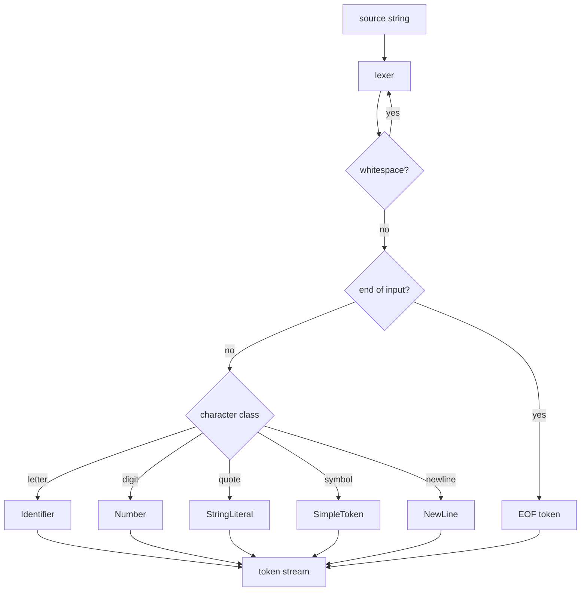

# londolang

A small programming language inspired by **Jai** and **Odin**, written in Odin itself.

> **Status:** lexer done, parser next.

## What's here

- A **cursor-based lexer** (`main.odin`) that turns source text into a token stream.
- Tokens carry **byte offsets**, not line/column numbers — positions stay O(1) to jump to, and the editor/compiler pipeline never has to count newlines.
- **Newlines are explicit tokens**, so the parser decides whether one ends a statement.
- Token values are **zero-copy slices** of the source; strings are escape-aware (`\"`, `\\`).
- A **table-driven test suite** (`lexer_test.odin`) run with `odin test .`.

## The lexer at a glance



## Setup

The toolchain (Odin master, gdb, gf2) is declared in the **devenv flake** (`devenv.nix`/`devenv.yaml`). Use Nix + devenv where possible, or a plain Odin install — the tests and demo work either way.

### Linux — Nix + devenv (recommended)

1. Install [Nix](https://nixos.org/download) (flakes enabled).
2. Enter the environment: `devenv shell` (first run compiles Odin from master — grab a coffee).
3. Run it: `devenv shell --quiet odin run .` · test: `devenv shell --quiet odin test .`

(`nix develop --no-pure-eval` enters the same environment.)

### Windows

**Option A — WSL2 + Nix (recommended).** The flake targets Linux; run it inside WSL2:

1. Install [WSL2](https://learn.microsoft.com/windows/wsl/install), then Nix inside it.
2. `devenv shell`, then `odin run .` / `odin test .`.
3. The gf2 debugger works through [WSLg](https://learn.microsoft.com/windows/wsl/tutorials/gui-apps) (Windows 11).

**Option B — native.** Install Odin directly:

```sh
scoop install odin
# or download the nightly from https://odin-lang.org
```

Then `odin run .` and `odin test .` work with no Nix involved.

### macOS

**Nix + devenv:** the flake supports `aarch64-darwin` and `x86_64-darwin` — same steps as Linux.

**Plain Odin:**

```sh
brew install odin
odin run .
```

### Odin master without the project flake

The compiler itself is also packaged as a standalone flake, [londospark/odin-nightly-flake](https://github.com/londospark/odin-nightly-flake):

```sh
nix run github:londospark/odin-nightly-flake -- version
```

## Debugging with gf2

```sh
devenv shell --quiet odin build . -debug
devenv shell --quiet gf2 ./londolang
```

[gf2](https://github.com/nakst/gf) is the graphical GDB frontend (the one Tsoding uses). `.project.gf` configures it to load `londolang`, disable its gvim sync, and pause at `main` on launch. In Sublime Text, open `londolang.sublime-project` and hit **Ctrl+B** with **Odin: Debug (gf2)** selected.

## Mermaid diagrams on GitHub

Diagrams in this README use [Mermaid](https://mermaid.js.org), which GitHub renders **natively** — no plugin or image host required. To add one, wrap it in a fenced code block tagged `mermaid`:

````markdown

````

GitHub renders these in Markdown files, issues, pull requests, wikis, and discussions. The gotchas:

- GitHub bundles its **own (older) Mermaid version**, so the latest features may not render.
- `%%{init: ...}%%` config directives and some theme options are **ignored** — stick to plain syntax.
- Safe diagram types: `flowchart`/`graph`, `sequenceDiagram`, `classDiagram`, `stateDiagram-v2`, `gantt`, `pie`, `erDiagram`, `gitGraph`.
- Check which Mermaid version GitHub is running by putting `info` in a block:

```mermaid
info
```

- Preview locally first: the [Mermaid Live Editor](https://mermaid.live) or `npx @mermaid-js/mermaid-cli`.
- Don't combine third-party Mermaid browser plugins with GitHub's renderer — they can error.
